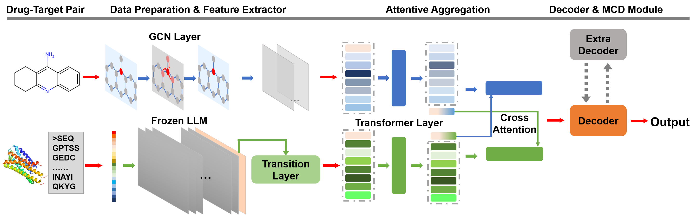

# Strongly interpretable attention network with debiasing design for drug-protein interaction prediction

<div align="left">

[](https://github.com/CQ-zhang-2016/UdanDTI/blob/main/LICENSE.md)
</div>


## Introduction
This repository contains the PyTorch implementation of **UdanDTI** framework, as described in our paper "[Strongly interpretable attention network with debiasing design for drug-target interaction prediction]".  **UdanDTI** is a novel unbalanced dual-branch attention-based neural network designed to overcome the drug bias, enhancing the interpretability and generalization of drug-target interaction (DTI) prediction. **UdanDTI** outperforms exsiting state-of-the-art (SOTA) methods across in-domain, cross-domain, and interpretability settings on independent public datasets.
**UdanDTI** works on two-dimensional (2D) drug molecular graphs and target protein sequences to perform prediction.

## Framework


## Installation Guide
Clone this Github report and set up a new conda environment. It normally takes about 10 minutes to install.
Before using UdanDTI, you need to generate protein embedding features by [ESM](https://github.com/facebookresearch/esm) [4] or [ProtTrans](https://github.com/agemagician/ProtTrans) [5]. Or you could download and unpack the generated features by following the instructions from `datasets/README.md`.

```
# clone the source code of UdanDTI
$ git clone https://github.com/CQ-zhang-2016/UdanDTI.git
$ cd UdanDTI

# create a new conda environment and install requried dependencies
$ conda create --name UdanDTI python=3.8
$ conda activate UdanDTI
$ conda install -c dglteam/label/cu118 dgl
$ pip install -r requirements.txt
```


## Datasets
The `datasets` folder contains all experimental data used in UdanDTI: [BindingDB](https://github.com/peizhenbai/DrugBAN) [1], [BioSNAP](https://github.com/kexinhuang12345/MolTrans) [2] and [Human](https://github.com/lifanchen-simm/transformerCPI) [3]. 
In `datasets/bindingdb` and `datasets/biosnap` folders, we have full data with different splits of random, clustering-based, unseen-drug, and unseen-protein.
In `datasets/human` folder, we have full data with random split for the in-domain experiment, and with cold split to alleviate ligand bias.
In `datasets/protein_features`, you should locate different protein embedding features generated by [ESM](https://github.com/facebookresearch/esm) and [ProtTrans](https://github.com/agemagician/ProtTrans).


## Run UdanDTI on Our Data to Reproduce Results

To train UdanDTI, where we provide the basic configurations for all hyperparameters in `config.py`. For different in-domain and cross-domain tasks, the customized task configurations can be found in respective `configs/*.yaml` files.

For the in-domain experiments with vanilla UdanDTI, you can directly run the following command. `${dataset}` could either be `bindingdb`, `biosnap` and `human`. `${split_task}` could be `random`, `cold`, `unseen_drug`, and `unseen_drug`. 
```
$ python main.py --data ${dataset} --split ${split_task}
```

For the cross-domain experiments with vanilla UdanDTI, you can directly run the following command. `${dataset}` could beither `bindingdb`, `biosnap`.
```
$ python main.py --data ${dataset} --split "cluster"
```


## References
    [1] Bai P, Miljković F, John B, et al. Interpretable bilinear attention network with domain adaptation improves drug–target prediction[J]. Nature Machine Intelligence, 2023, 5(2): 126-136.
    [2] Huang, Kexin, Cao Xiao, Lucas M. Glass, and Jimeng Sun (2021). MolTrans: Molecular Interaction Transformer for drug–target interaction prediction. Bioinformatics, 37(6), 830-836.
    [3] Chen, Lifan, et al (2020). TransformerCPI: improving compound–protein interaction prediction by sequence-based deep learning with self-attention mechanism and label reversal experiments. Bioinformatics, 36(16), 4406-4414.
    [4] Rives A, Meier J, Sercu T, et al. Biological structure and function emerge from scaling unsupervised learning to 250 million protein sequences[J]. Proceedings of the National Academy of Sciences, 2021, 118(15): e2016239118.
    [5] Elnaggar A, Heinzinger M, Dallago C, et al. Prottrans: Toward understanding the language of life through self-supervised learning[J]. IEEE transactions on pattern analysis and machine intelligence, 2021, 44(10): 7112-7127.
